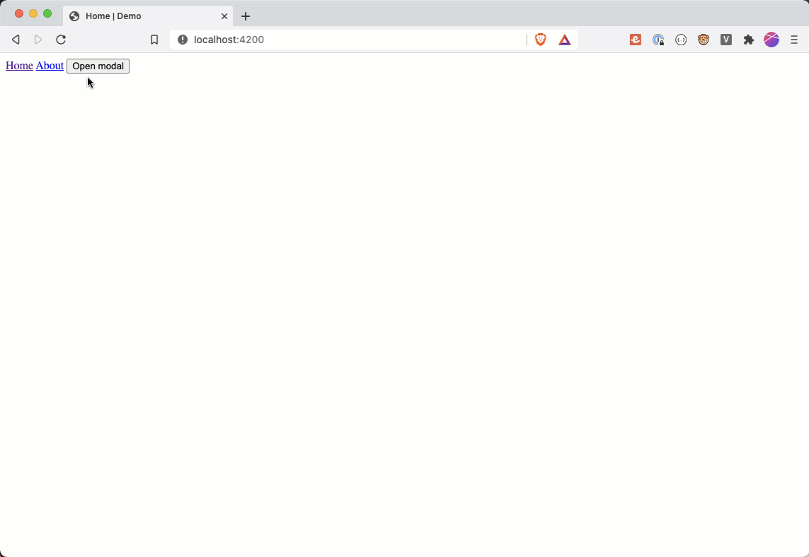

There're a lot of situations when we need to create a focus trap in a particular area, for example in modal, a popup menu, or a dropdown...

### Implement a focus trap area

Assume that the **el** element is the parent element for the target area:

```jsx
<section id="parent">
  {/* ... */}
</section>

const el = document.getElementById('parent')
```

1. List all of the focusable elements

```jsx
 const FOCUSABLE_ELEMENT_SELECTORS =
   'a[href], area[href], input:not([disabled]), select:not([disabled]), textarea:not([disabled]), button:not([disabled]), iframe, object, [tabindex="0"], [contenteditable]';
```

2. Create an **isHidden** function to check if the element is hidden

```jsx
function isHidden(el: Element): boolean {
  return el.offsetParent === null;
}
```

3. Get all elements and filter hidden elements

```jsx
const allElements = el.querySelectorAll(FOCUSABLE_ELEMENT_SELECTORS);
const focusableElements = [];

for (let i = 0, max = allElements.length; i < max; i++) {
  if (!isHidden(allElements[i])) {
    focusableElements.push(allElements[i]);
  }
}
```

4. Determine the first and the last focusable element of the area

```jsx
const firstFocusableEl = focusableElements[0];
const lastFocusableEl = focusableElements[focusableElements.length - 1];
```

5. Add an event listener to listen to the **keydown** event

Basically, when user press **tab** to move the focus forward or **shift-tab** to move backward, the current focus element is always staying inside the area.

```jsx
const handleKeyPress = (e: KeyboardEvent) => {
  if (e.key === "Tab") {
   if (e.shiftKey && document.activeElement === firstFocusableEl) {
     e.preventDefault();
     lastFocusableEl.focus();
   } else if (!e.shiftKey && document.activeElement === lastFocusableEl) {
     e.preventDefault();
     firstFocusableEl.focus();
   }
  }
};

document.addEventListener("keydown", handleKeyPress);
```

### Example



### Reference

https://medium.com/@im_rahul/focus-trapping-looping-b3ee658e5177