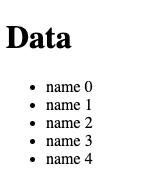
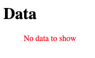

## :empty

The *:empty* CSS pseudo-class represents any element that has no children.

## Usage

The class is useful in some cases such as when there's "no data" passed to a list:

```jsx
export default function App() {
  return (
    <div>
      <h1>Data</h1>
      <ul>
        {data.map((item) => (
          <li>{item}</li>
        ))}
      </ul>
    </div>
  );
}
```

```css
// style
ul:empty::after {
  content: 'No data to show';
  color: red;
}
```

#### 1. When 'data' list is passed



#### 2. When there's no data



## Reference

https://developer.mozilla.org/en-US/docs/Web/CSS/:empty