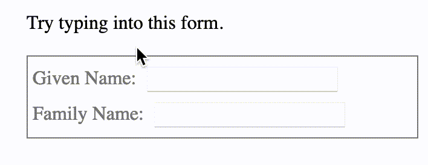

# :focus-within

The **`:focus-within`** [CSS](https://developer.mozilla.org/en-US/docs/Web/CSS) [pseudo-class](https://developer.mozilla.org/en-US/docs/Web/CSS/Pseudo-classes) represents an element that has received focus or *contains* an element that has received focus. In other words, it represents an element that is itself matched by the [`:focus`](https://developer.mozilla.org/en-US/docs/Web/CSS/:focus) pseudo-class or has a descendant that is matched by `:focus`.

This selector is useful, to take a common example, for highlighting an entire [`<form>`](https://developer.mozilla.org/en-US/docs/Web/HTML/Element/form) container when the user focuses on one of its [`<input>`](https://developer.mozilla.org/en-US/docs/Web/HTML/Element/input) fields.

## Example

### HTML

```html
<p>Try typing into this form.</p>

<form>
  <label for="given_name">Given Name:</label>
  <input id="given_name" type="text">
  <br>
  <label for="family_name">Family Name:</label>
  <input id="family_name" type="text">
</form>
```

### CSS

```css
form {
  border: 1px solid;
  color: gray;
  padding: 4px;
}

form:focus-within {
  background: #ff8;
  color: black;
}

input {
  margin: 4px;
}
```

### Result



## Reference:

https://developer.mozilla.org/en-US/docs/Web/CSS/:focus-within