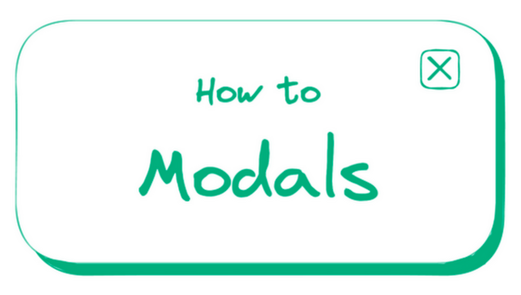
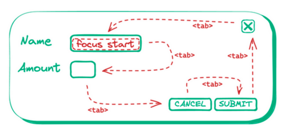
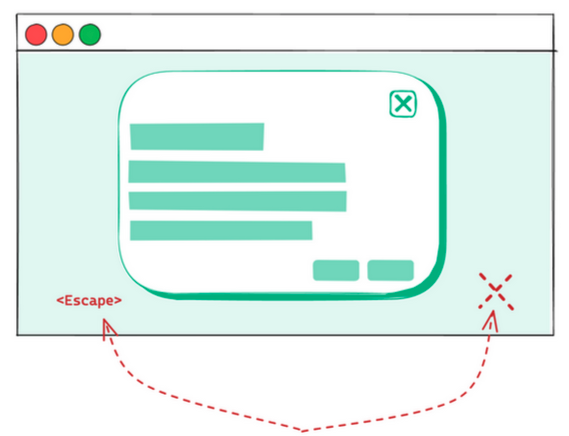
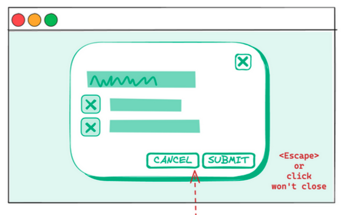
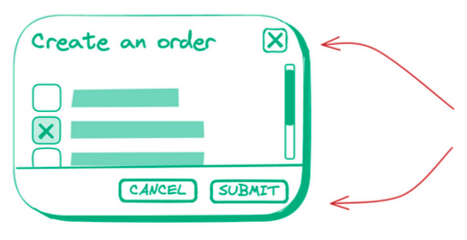
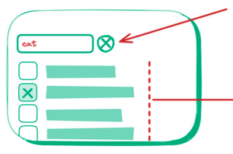

This guide will help you build a modal properly.

This was shared in WeBuild - a popular dev community in Vietnam.

## Focus trap

The focus trap should follow the figure's order.

## Accessible dismissal

Clicking on the modal background (which should usually cover the whole page) or pressing Escape should close the modal.

### Guard against accidental dismissal

When the form is filled, require explicit cancelation or submission to prevent users losing progress or forgetting to submit.

## Sticky header & footer

In long modal, make the header and the footer sticky so that users can see the control buttons without scrolling.

## Filterable lists

* Make long lists filterable
* Should have a button to clear the filter
* Set min-height to prevent layout shift when filtering