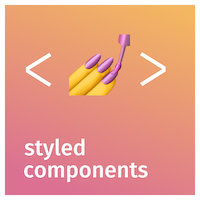

## Add breakpoint values to the global theme

```tsx
import { DefaultTheme } from "styled-components";


export const theme: DefaultTheme = {
  breakpoint: {
    sm: "480px",
    md: "768px",
    lg: "1024px",
  },
};
```

## Implement helper

```tsx
export const mediaQueries = (key: "sm" | "md" | "lg") => {
  return (style: TemplateStringsArray, ...values: string[]) => {
    const styles = style
      .map((str, index) => `${str}${values[index] || ""}`)
      .join("");
    
    return `@media (min-width: ${theme.breakpoint[key]}) { ${styles} }`;
  };
};
```

## Usage

```javascript
const Wrapper = styled.div`
  background-color: red;  /* mobile */

  ${mediaQueries("md")`  /* tablet & desktop */
    background-color: blue;
  `}
`;
```