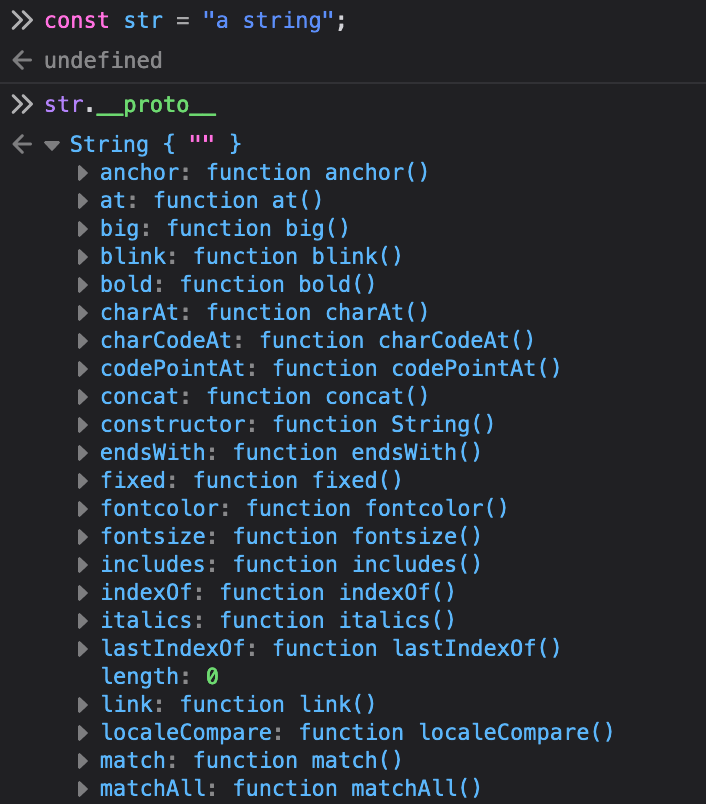

All JavaScript objects have a `__proto__` property, which is a reference to another object, which is called the object's "prototype". When a property is accessed on an object and if the property is not found on that object, the JavaScript engine looks at the object's `__proto__`, and the `__proto__`'s `__proto__` and so on, until it finds the property defined on one of the `__proto__`s or until it reaches the end of the prototype chain.

