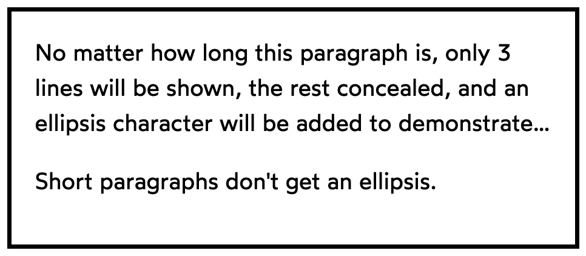

For a long time, this was a very hard problem that required some very complicated JavaScript. Fortunately, there is a modern way to solve this problem: the `-webkit-line-clamp` property.

```html
<style>
  p {
    display: -webkit-box;
    -webkit-box-orient: vertical;
    -webkit-line-clamp: 3;
    overflow: hidden;
    margin-bottom: 1em;
  }
  main {
    border: solid;
    margin: 0 auto;
    padding: 16px;
  }
</style>

<main>
  <p>
    No matter how long this paragraph is, only 3 lines will be shown, the rest concealed, and an ellipsis character will be added to demonstrate that there is more text that is not shown here.
  </p>
  <p>
    Short paragraphs don't get an ellipsis.
  </p>
</main>
```

## Result



### Reference

https://courses.joshwcomeau.com/css-for-js/06-typography-and-media/03-text-overflow

https://caniuse.com/?search=line-clamp