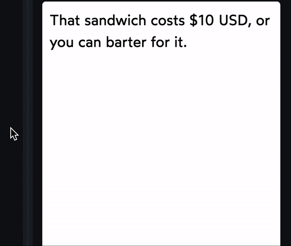

`&nbsp;` is the code for “Non-Breaking Space”. A whitespace character that connects the words on either side into a single unbreakable word. For example:

`
That sandwich costs $10&nbsp;USD, or you can barter for it.
`

### Reference

https://courses.joshwcomeau.com/css-for-js/06-typography-and-media/03-text-overflow