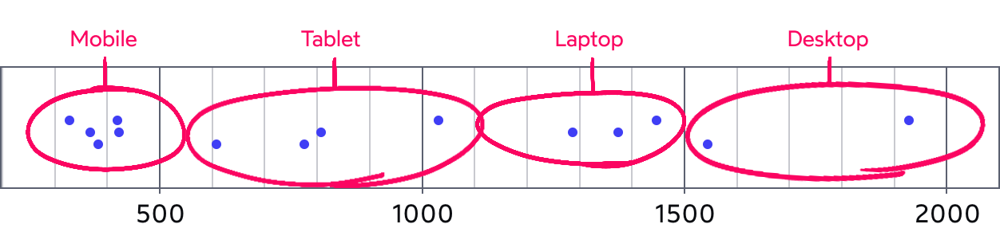

There's no perfect breakpoints.

Traditionally, developers tend to use common phone screen width to decide breakpoints, for example, the iPhone 12 has a screen width of 375px, so maybe that'll become our "phone" breakpoint.

This is not the right approach. Most common device resolutions should sit in the middle of each grouping. In other words, they should be in “no-device land”. This way, all similar devices will share the same layout.

The image shows the most popular screen resolutions by platform, we can identify breakpoints by groups:

* 0-550px — Mobile
* 550-1100px — Tablet
* 1100-1500px — Laptop
* 1500+px — Desktop

### Reference

https://courses.joshwcomeau.com/css-for-js/05-responsive-css/07-breakpoints