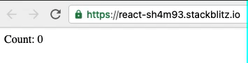

## React Context

Context is primarily used when some data needs to be accessible by *many* components at different nesting levels.

## Implementation

### Step 1: Declare a Provider and a Consumer 

```jsx
import { createContext, useState } from 'react';

const { Provider, Consumer } = createContext();

```

### Step 2: Use the Provider to pass state values to child nodes

```jsx
export default function App() {
  const [count, setCount] = useState(0);
  
  return (
    <Provider value={{ count, setCount }}>
      <SampleChildNode />
    </Provider>
  );
}
```

### Step 3: Use the Consumer to use the Context values as props

```jsx
const SampleChildNode = () => {
  return (
    <Consumer>
      {({ count, setCount }) => (
        <div onClick={() => setCount(count + 1)}>
          Count: {count}
        </div>
      )}
    </Consumer>
  );
};
```

## Full Example



```jsx
import { createContext, useState } from 'react';

const { Provider, Consumer } = createContext();

export default function App() {
  const [count, setCount] = useState(0);
  
  return (
    <Provider value={{ count, setCount }}>
      <SampleChildNode />
    </Provider>
  );
}

const SampleChildNode = () => {
  return (
    <Consumer>
      {({ count, setCount }) => (
        <div onClick={() => setCount(count + 1)}>
          Count: {count}
        </div>
      )}
    </Consumer>
  );
};
```

## Reference

https://reactjs.org/docs/context.html