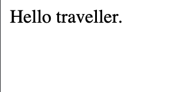

```css
:root {
  --color-text: black;
  --color-background: white;
  
  [data-theme="dark"] {
    --color-text: white;
    --color-background: black;
  }
}


body {
  color: var(--color-text);
  background-color: var(--color-background);
}
```

```html
<body data-theme="dark">
  Hello traveller.
</body>
```

## Result


