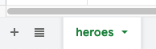
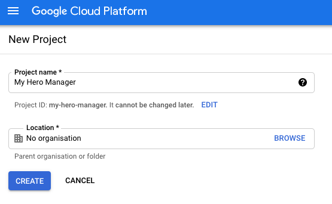
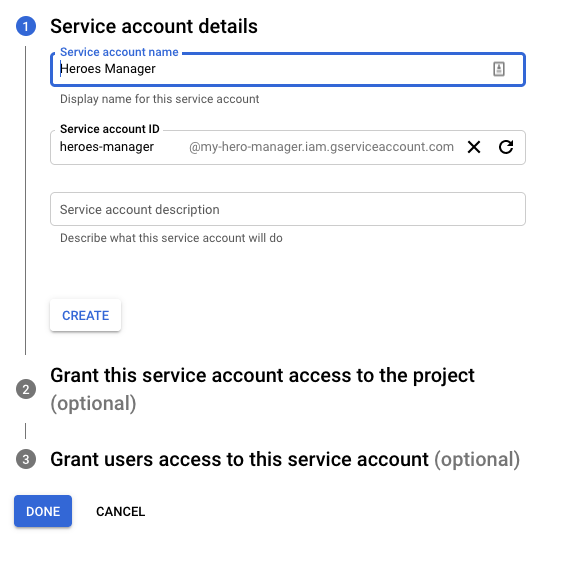
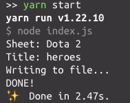
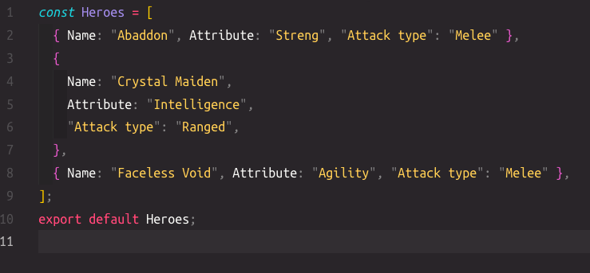

![](data:image/png;base64,iVBORw0KGgoAAAANSUhEUgAAAHUAAACgCAMAAAAFKdMSAAAAkFBMVEX////y8vIXoF0gpGQZoV8fpGMhpGQlpmcYoV8XoF6O0bEipWUeo2IaomAdo2IjpWYbomEcomEWoF0kpWby+PUekVsamVyBvprH3tL99/s0p2uRxqcAnVhpt4w7qXBUtILa5+Cr0bu11sNxvJcLhlEymGao2sI2oGoAmUxftIXQ4djB3s2k0rhFsHmDyqdOpHn6b6Q8AAAGOElEQVR4nOXcaXfaOBQGYPY6AzayzDQNmDTLdEoakvn//25YvEhXd5OA0w99P8I5fc57ZQlMIYPBn5in/ebzkPvE7FPM90eby7Fk6o9/49HXfPoFS3XO8pz5ObNzxudMT8m//xXLrj4sakJ1yaqx7FtOoHFqHLunmsaqUWw2V6r8uh7yqWdf6KqxakTbe3JVE1Qtu/o+vqaqHPLqkV7WBFXZ9uqqir2+qhkyp1ZJqqbtLVSZVag+OvdQXBXZ26gSy6iaAVOqwMrqUl5WROXZm6ksS6tVhJohKrdv1aqPKlSuLanyVVUqzSaqPkqp5JAptcIHHKeSba+iLkiVYAkVovyyMirOCuqSrapRURZXqapTfFlZFWNRNUCFZeVVhMXUiqpKLaughiyihqi0rJIasKFaqavqVcgGKoIKAz6o+YegAhaqHEoOeGHWkuqzQK0iqjrqov6MYj21QlF5wIuFlRbWZ3u1quJQTy1KuazDrh7HFZYQ5QZ8uIofZbV/4dOrM2bAyhl3LK4u9VVbtbDi7ulZVMVQfsAHtci/vmrXFlOXmqqhWky//vhv+ypkg6tLFiUHXJzYf8T8WGEqjkrX0lk9sH9LwdSlEiVUBRuqSxGV1DKXWE9dhpnHVy1KkW1VBJRQsmopsryKoYqqIsuq85SqZ5VnGXWuQ7EBSyyt4qi2alkaQ7OUOteilGqModsSKoXSVeGADcdi6nyuR5kBH0OwgQpJHCWrFh5KtfXUUJRQoSrFNuoUBQHKzJdS8xxlJRVF6aoFrHpiv8L8ZNWZEqUHfGKj1KWEqqq6bDNgTp0RaGxVpC2pzhJQSp1AllBnClRfdQJZVIWmEmVUwAZqIFIoXbUMUcCe1XWBYaGZXBWwa1GVULIqUF1WVNWoUHUyyXKtOibQhKqTLMvvVGoEGlQ1AZp1bTl1nIIyVY+549UxzBRTC7EqUM8sobJmgcTAEGh2d4jFVN8zGQj97RD3iyK1VanjsOAx+f7Xt6TsrYu2qvVUVDzGfnsYpuThm6WqqtQkdDj0VA+9s9VtVbTqnf0iqNPfoB62yUUqjvLqaXO26kOQIf9EmtocCY36sHnb+nlt1C3M5qFV4baR1P4gatVtDY6BqlGrujsYztm2akaguOqefr1qF96Zb9aNujb+CWz1aj6lgqkFprYHcN/VEugoSS0w1dxYLTDV0CpEk9SCV3NRHclq0avg65CdmvmPQzWsKqqLXs381/1Fpy78J6ygjiT1OM/2bHoKMuSfaNQsTm1W8YJz2BJVSbXfJReqWFVEXfi5luqivbogUlzwmmOJqnr14XkD06jB48/9NYyjEepbDTJr1Bl4fPd2RXVr/Xf5ztnkv+12TokATVdLXMXOJqKqqBaBWuIqeiISVQX1qAC1TFAhyqjtKnpqWRJqj06SVfdmzVVLSnXQUA1QRIW3iN3O2YEdMmnUib9vds7OodBOxe5JXXX49AumUYPH+9ecy9XoQNVBb69iVW+uoqio5tdWrUItTau+P4O8NP/6C3zi3VHxqqx62pbUztmNGnW0A3F2zh1elVGbw6A/Jfy3+Aa8MzXtTY17ShBVUdU7glzV+0CpU/3PWlyVQlvVlERc1dDqBFPD+QI1U6g+mrmqg2ZIV4gmq7mrTlC1DtAU1Zlw6ao+yqndjf5aq3o757hBxJ1Tk6haHb6/wLSnBEx7SqSrxqSfiDWFjlj1/OHGhSrSlFa7C+dCNbx+7QhXvS1yLdVBe9VQuUzF5qtTUz+Vron5atTsNbhp0+WVRBWqgfdy6jhovGrcN9ltzGTin4Ph7RtdVaOGpPca45sCqlQxEpjxKKuiohql58uoFAlND1VW7e6uMlFTmFq0UzW/3g5Nsii9aaJV3hRRp6peDczIpm5VtSqYcahOlXrGorKKiGxRCdWouKlEyaqcSohwuAkorlLe5Siush5matCgavN/zY9W5BSmGm1O/w+VGpipaP1xVAf39eWmjPbq/enHDc+SGpIXoHb3fP4lx44dscKMQe2u+dXKni6LkWxRGe3+mMobyuIiX9RFkSvpsKpvLTpY/awzHyTJwNSg/cP142rQZ1tbqaKiqITW9Xbg5X0NP3i+fnbr9wHM036T+td2VNnsnwLzT8j/he/p9Y8wrzAAAAAASUVORK5CYII=)

## But first, why?

* Very easy to edit
* Can access the sheet from any device
* Sharing it with other people
* Version control history

## 1. Create a sheet

I created this sheet about Dota 2 heroes info:


Sheet title is: **heroes**



also remember the sheet id: https://docs.google.com/spreadsheets/d/**\[sheet-id]**/edit#gid=0 

## 2. Setup Google Cloud API

Go to [Google API Console](https://console.cloud.google.com/) -> select project -> create a new project.



Go to Menu -> API & Services -> Library, select "Google Sheets API" and click "Enable".

Now you need to create the credentials to authenticate & access the data.

Go to Menu -> API & Services -> Credentials -> Create Credentials -> Service account key.



Next, you will need to select a role: Current user -> Owner is good.

Next, you need to create a key, select service account -> Keys -> Add keys -> Create new key -> JSON.

Save the downloaded file as **credentials.json**

Now you need to grant the service account email permission to read and write on the sheet, go back to the sheet, click on Share -> add the account email address.

## 3. Read data from the sheet

Now we have everything ready to start building an app to read our data in the sheet.

I created a new simple Node app and published it [here.](https://github.com/vuongvu1/my-hero-manager)

First, copy the **credentials.json** file to the project directory.

Then, create an .env file to store our sheet_id and sheet_title.

Here is the main script (index.js):

* imports:

```javascript
require("dotenv").config();
const { GoogleSpreadsheet } = require("google-spreadsheet");
const fs = require("fs");
const creds = require("./credentials.json");
```

* authenticate and read the sheet content:

```javascript
const doc = new GoogleSpreadsheet(process.env.GOOGLE_SHEET_ID);
await doc.useServiceAccountAuth(creds);
await doc.loadInfo();
console.log(`Sheet: ${doc.title}`);

const sheet = doc.sheetsByTitle[process.env.GOOGLE_SHEET_TITLE];
console.log(`Title: ${sheet.title}`);

await sheet.loadHeaderRow();
const rows = await sheet.getRows();
const formattedRows = rows.map((row) => ({
  Name: row.Name,
  Attribute: row.Attribute,
  "Attack type": row["Attack type"],
}));

writeContent(formattedRows);
```

* write content to a file:

```javascript
const writeContent = (rowData) => {
  const content = `
    const Heroes = ${JSON.stringify(rowData)};
    export default Heroes;
  `;

  console.log("Writing to file...");

  fs.writeFile("output/index.js", content, function (err) {
    if (err) return console.log(err);
  });

  console.log("DONE!");
};
```

* add a script in package.json

```json
"scripts": {
  "start": "node index.js"
}
```

* run the script



* output file



So we did successfully use Google Sheets API as our private CMS, from here, we can modify the sheet and run the app again to see the changes.

And we can explore the API to create more functions like write, delete, update the cells, rows... of the sheet with convenience.