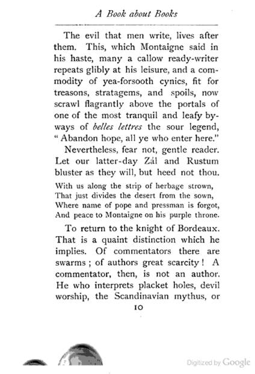

> Do you wonder why books use serif fonts? Because serif fonts lead the eyes forward, making the text easier to read. Besides, the letters in books are too small and many, thus far you should direct the eyes to the right. A letter with serifs will limit to whitespace between words. As such, there’s no vertical movement the eyes and serifs suggest a connection between letters to improve readability of user.

### Reference

https://medium.com/dwarves-design/the-principle-of-spacing-in-ui-design-part-1-3354d0d65e51